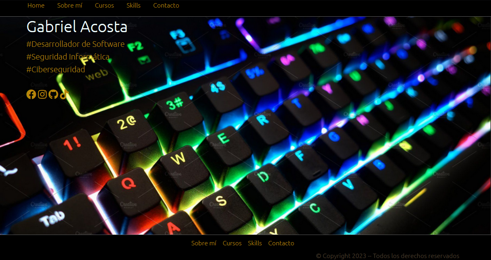
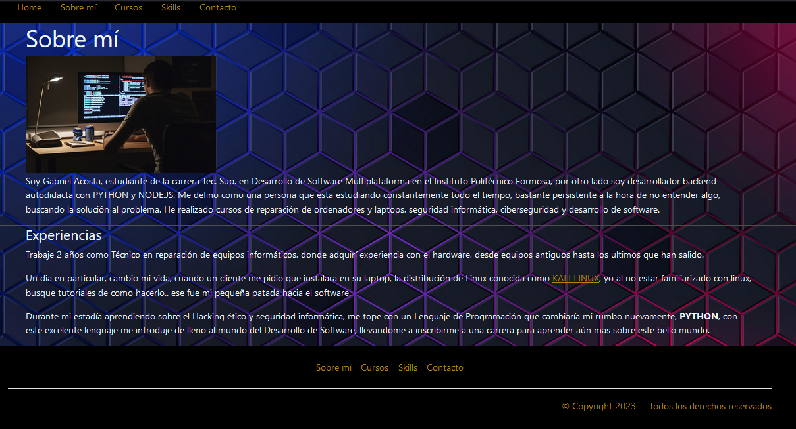
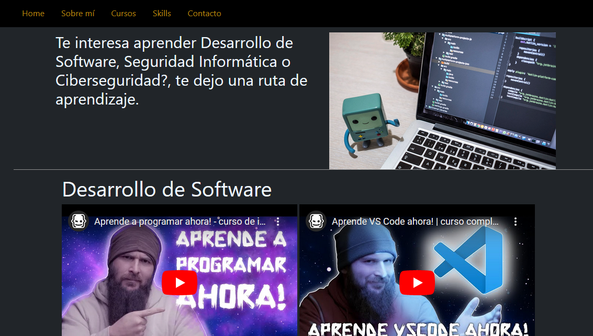
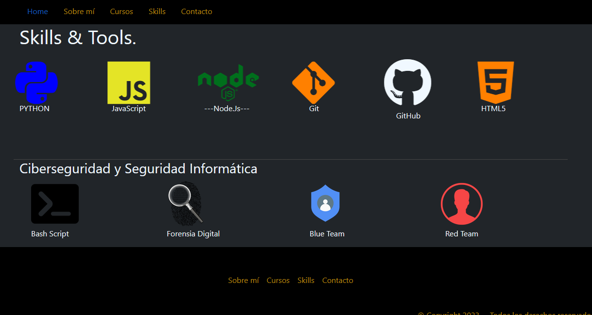
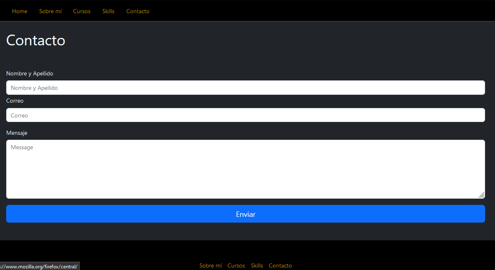

                    Primer parcial Taller de Programación

Este es el trabajo realizado para el Parcial de la materia Taller de Lenguajes de programación, realizado en el Instituto Politécnico Fomrosa.
Este repositorio cuenta con el Portfolio del Alumno Acosta Gabriel Hernan Miguel, el mismo consta de:
- Home 

- Sobre mí

- Cursos

- Skills

- Contactos
